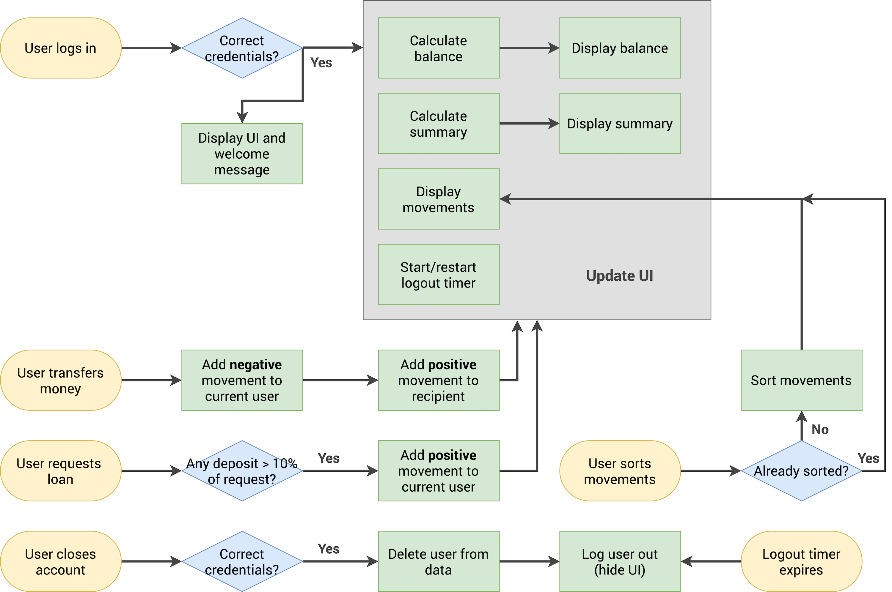

# Bankist

Bankist is a responsive digital banking application built with HTML, CSS, and vanilla JavaScript. It simulates a modern online banking experience where users can log in, view their account information, manage transactions, transfer money, request loans, and manage their accounts.

## Features

* Responsive digital banking interface
* User login with username and PIN authentication
* Multiple demo bank accounts
* Dynamic account balance calculation
* Transaction and movement history
* Transaction date formatting
* Income, expenses, and interest summaries
* Money transfers between accounts
* Loan request functionality
* Account closure functionality
* Transaction sorting
* Automatic logout timer
* Currency formatting based on account locale
* Dynamic dashboard updates

## Project Structure

```text
Bankist/
├── index.html              # Main banking application
├── styles.css              # Application and landing page styles
├── script.js               # Banking functionality and interactions
├── logo.png                # Bankist logo
├── icon.png                # Application icon
└── Bankist-flowchart.png   # Application flowchart
```

## Run Locally

Install [Node.js](https://nodejs.org/) and `live-server` globally before running the project:

```bash
npm install -g live-server
```

Clone the repository, enter the project directory, and start the local server:

```bash
git clone https://github.com/athumanrajab/Bankist.git
cd Bankist
live-server
```

Then open:

```text
http://127.0.0.1:8080
```

## Demo Accounts

Use the following credentials to access the different demo accounts:

| Username |    PIN | Account           |
| -------- | -----: | ----------------- |
| `js`     | `1111` | Jonas Schmedtmann |
| `jd`     | `2222` | Jessica Davis     |
| `dp`     | `3333` | Danniel Purcell   |

## How It Works

1. Log in using one of the demo accounts.
2. View the account balance and transaction history.
3. Check income, expenses, and interest summaries.
4. Transfer money to another account.
5. Request a loan.
6. Sort transactions by amount.
7. Close the account if needed.
8. The application automatically logs the user out after the session timer expires.

## Technologies

* HTML5
* CSS3
* Vanilla JavaScript
* DOM Manipulation
* JavaScript `Intl` API
* `setTimeout`
* `setInterval`
* Google Fonts: Poppins

## Flowchart

The project includes a flowchart showing the main application logic and user flow.



## Visit the Website

```text
https://athumanrajab.github.io/Bankist/
```

## Contact

Email: [athumanrajab0903@gmail.com](mailto:athumanrajab0903@gmail.com)
Phone: +255 795 077 000
